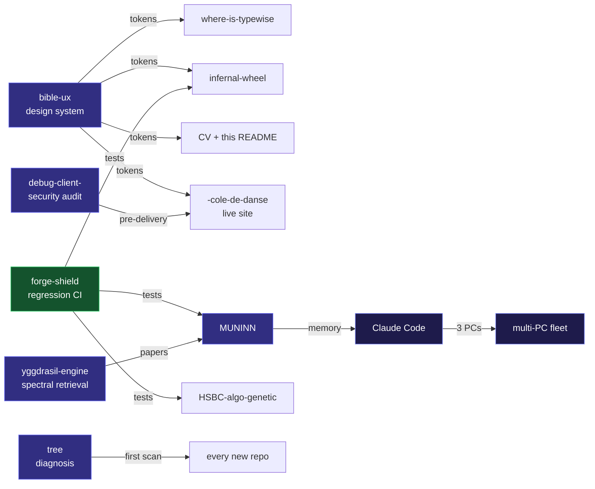

<picture>
  <source media="(prefers-color-scheme: dark)" srcset="./assets/hero-dark.svg">
  
</picture>

<div align="center">

> I write code by orchestrating LLMs across 3 PCs talking to each other.
> The toolchain to do that turned out to be half my repos.

[](mailto:ludovik1241@gmail.com)

[](mailto:ludovik1241@gmail.com)
[](https://pypi.org/project/forge-shield/)
[](https://haoyanwuying.com)

</div>

---

## Currently (May 2026)

- Building **[MUNINN](https://github.com/sky1241/MUNINN-)** v1.2 — compression past `x5`, sleep-consolidation pruning
- Repeating **[forge-shield](https://github.com/sky1241/forge)** cycle 15 on a 4× larger panel (cycle 25)
- Wiring `data/latest` → `main` sync on **[where-is-typewise](https://github.com/sky1241/where-is-typewise)**
- Copyright review pass on **[bible-ux](https://github.com/sky1241/bible-ux)** v1.9 for Gumroad release
- **Open to**: Malt / Codeur freelance · YC AI Engineer / Growth Engineer roles

## Lately I've been thinking about

- Why my honest-negatives policy gets more recruiter trust than my wins
- Whether dogfooding is a moat or a tax
- How to ship a 47K-line UX spec without becoming a librarian
- What a tiny startup actually needs from an AI engineer in month one

> **Honest science** — I publish admitted negatives in plain sight: forge cycle 12 v3 verdict `0/3 OUI`, HSBC K3 OOS Sharpe `–1.91`, BUG+053 self-found label-leakage that invalidated prior F1 metrics. Rare in indie OSS — and the reason recruiters can trust the rest of the numbers on this profile.

---

## How I work

Multi-PC fleet (3 Debian machines, systemd-managed) running **Claude Code in parallel sessions** that talk to each other via a git-branch-based MESSAGE protocol I built. Memory is persisted across sessions through my own MCP server (MUNINN), context is compressed at `x4.4` ratio with measured `92%` fact retention. Code goes through my own pytest regression shield (`forge-shield`) before any push.

I had to build the toolchain itself — which turned out to be the most interesting part of the work, and the source of half of these projects.

---

## Toolchain — dogfooded

These tools are not portfolio decorations. Each one is in daily production use by me, in my own workflow. **This README itself was designed using them** — same indigo `#312e81 / #4f46e5 / #6366f1 / #818cf8` ramp, same `labelColor` pairs, same density rules.

| Tool | Daily use |
|------|-----------|
| **[bible-ux](https://github.com/sky1241/bible-ux)** | Source of truth for every UI / design decision I make — including this README. My CV PDF, [haoyanwuying.com](https://haoyanwuying.com), infernal-wheel dashboard: all token-exported from `VALUES.md`. |
| **[forge-shield](https://github.com/sky1241/forge)** | Runs on every commit across my repos — defect prediction, mutation testing, flaky detection, fault localization. Caught BUG+053 (label-leakage) before infernal-wheel shipped. |
| **[MUNINN](https://github.com/sky1241/MUNINN-)** | Persistent memory across all my Claude Code sessions on 3 PCs. `x4.4` compression on 230 real files, `92%` fact retention. Lets me switch between MUNINN dev, HSBC monitoring, and shazam-piano UX without losing state. |
| **[yggdrasil-engine](https://github.com/sky1241/yggdrasil-engine)** | Scientific literature retrieval — 65K OpenAlex concepts × 108M pairs, spectral. 38 documented sessions. Published Cohen's `d = 5.76` with bias corrections. |
| **[tree](https://github.com/sky1241/tree)** | Project diagnosis + planning — maps a new codebase to one of 6 biological tree architectures (conifer / deciduous / palm / baobab / shrub / liana) and tells me what to build first, what to defer. Used on every new repo since March 2026. |
| **[debug-client-](https://github.com/sky1241/debug-client-)** | Security audit framework — 24 SAST tools sandboxed under firejail. Ran end-to-end against my own `-cole-de-danse` before delivering to client. 14/15 mutation tests confirmed. |

**Signal**: I don't ship libraries I wouldn't run on my own production code.

### Cross-references



Read as: my own libraries call my own libraries. Any improvement to `bible-ux` propagates to 4 deliveries; any new `forge` sub-command lints 3 other repos on next push; any MUNINN compression gain shortens every future Claude Code session across 3 PCs.

---

## Selected projects

Legend: 🟢 live in production · 🟣 source-only

<table>
<thead>
<tr><th>Project</th><th>What it does</th><th>Stack</th></tr>
</thead>
<tbody>
<tr>
<td>🟢&nbsp;<b><a href="https://github.com/sky1241/forge">forge-shield</a></b> · <a href="https://pypi.org/project/forge-shield/">PyPI</a> · <a href="https://github.com/sky1241/forge-case-studies">case-studies</a></td>
<td>Pytest regression shield · 14 pre-registered cycles · 287 tests across 9 OS/Python combos · 100% mutation kill vs <code>mutmut</code> 33% on httpie/argparser · sister repo <code>forge-case-studies</code> publishes 11 FINAL_REPORTs with Fisher + Wilson CI + admitted negative (cycle 12 v3 = 0/3 OUI, i.e. <em>forge at random baseline</em>)</td>
<td>Python · stdlib-only · <code>mypy --strict</code></td>
</tr>
<tr>
<td>🟢&nbsp;<b><a href="https://github.com/sky1241/where-is-typewise">where-is-typewise</a></b> · <a href="https://where-is-typewise-knsgq4frwunfgefuxp4w3a.streamlit.app">demo</a></td>
<td>Growth-ops radar + MCP server (7 tools) · Claude Haiku scorer with prompt caching · 167 tests · built in 3 h, 30 commits</td>
<td>Python · Anthropic SDK · Streamlit</td>
</tr>
<tr>
<td>🟣&nbsp;<b><a href="https://github.com/sky1241/MUNINN-">MUNINN</a></b></td>
<td>Persistent memory engine for LLMs · 120K+ LOC · x4.4 compression · 92% fact retention (37/40) · 10 MCP tools · 2,849 CI tests</td>
<td>Python 3.13 · MCP · SQLite · tiktoken</td>
</tr>
<tr>
<td>🟣&nbsp;<b><a href="https://github.com/sky1241/HSBC-algo-genetic">HSBC-algo-genetic</a></b></td>
<td>Quant trading research on 14 yr BTC · HMM + GARCH + walk-forward · honest negatives published (DSR, Hansen SPA, anti-lookahead audit)</td>
<td>Python · SciPy · HMM · GARCH</td>
</tr>
<tr>
<td>🟣&nbsp;<b><a href="https://github.com/sky1241/bible-ux">bible-ux</a></b></td>
<td>47,021-line cross-platform UX rules · 1,895 H3 patterns · 331 sections · 20 AI prompt templates · 8 design-token export formats · 180 links / 0 broken · 113 Baymard citations</td>
<td>Design tokens · WCAG 2.2 · AI prompts</td>
</tr>
<tr>
<td>🟣&nbsp;<b><a href="https://github.com/sky1241/infernal-wheel">infernal-wheel</a></b></td>
<td>On-device cigarette detection on Samsung smartwatch · TFLite int8 35 KB · 100% local · 340 tests</td>
<td>Flutter · Kotlin / Compose · TFLite</td>
</tr>
<tr>
<td>🟣&nbsp;<b><a href="https://github.com/sky1241/yggdrasil-engine">yggdrasil-engine</a></b></td>
<td>Spectral engine for scientific cartography · 65K concepts × 108M pairs · Cohen's d = 5.76 with documented bias corrections</td>
<td>Python · SciPy eigsh · graph Laplacians</td>
</tr>
<tr>
<td>🟣&nbsp;<b><a href="https://github.com/sky1241/debug-client-">debug-client-</a></b></td>
<td>Security audit framework · 24 SAST tools orchestrated · firejail sandbox · 14/15 mutation tests confirmed</td>
<td>Bash · Python · firejail · SAST</td>
</tr>
<tr>
<td>🟢&nbsp;<b><a href="https://github.com/sky1241/-cole-de-danse">-cole-de-danse</a></b> · <a href="https://haoyanwuying.com">live</a></td>
<td>Dance-school vitrine site in China · mobile-first · WeChat + Baidu Maps integration · zero backend</td>
<td>HTML/CSS/JS · GitHub Pages · schema.org</td>
</tr>
<tr>
<td>🟣&nbsp;<b><a href="https://github.com/sky1241/shazam-piano">shazam-piano</a></b></td>
<td>Shazam-style piano learning · record 8 s → 4 progressive videos · audio DSP from papers (Goertzel, YIN/PYIN, Krumhansl-Schmuckler)</td>
<td>Flutter · FastAPI · BasicPitch · FFmpeg</td>
</tr>
<tr>
<td>🟣&nbsp;<b><a href="https://github.com/sky1241/drugsv2">drugsv2</a></b> · ancestor of MUNINN</td>
<td>RP-immersive harness → spec → code. Birthplace of <strong>SQLite WAL mycelium</strong> (<code>mycelium_db.py</code> 993 LOC, lifted into MUNINN) &amp; <strong>Cube Engine</strong> async architecture · 11 sourced patterns (Aron, Greene, Fiske, FSRS, Shute Stealth Assessment, peak-end Alaybek)</td>
<td>SQLite WAL · mycelium graph · FSRS-lite · DOI-verified</td>
</tr>
</tbody>
</table>

---

## Recent milestones

<!-- MILESTONES:START -->
```
2026-05-22  ─  where-is-typewise · fix(BUG-002): headline metrics zeroed by 7-day window on…
2026-05-19  ─  MUNINN- · fix: REMEDIATION-3 F1-F5 — post-3ème-audit (rapport docs/AUDIT_REPO…
2026-05-12  ─  forge v2.1.2 tagged
2026-05-12  ─  forge-case-studies · Merge cycle 24 (Option B + kalman fix benchmark = NEUTRA…
2026-05-11  ─  forge v2.0.0 tagged
2026-05-11  ─  forge-case-studies · Merge cycle 20 v2 (sanity at scale OUI 6/6 sur 30 cas ré…
2026-05-06  ─  debug-client- v3.1.0 tagged
2026-05-05  ─  debug-client- v2.0.2 tagged
2026-05-01  ─  HSBC-algo-genetic · Merge feat/multi-tf — mission MULTI_TF complète (P-MTF-1…
2026-04-28  ─  HSBC-algo-genetic · merge: feat/p7bis-r7bis-status — STATUS + P7-bis + R7-bis…
2026-04-21  ─  yggdrasil-engine · Session 38: 7 méthodes testées — r = époque (10.5%), K à 4…
2026-04-17  ─  bible-ux · feat(prompts): v1.4 — 3 workflow prompts (pick-pattern, spec, code…
2026-04-14  ─  infernal-wheel · feat: BUG+018 FIXED — CryptoService wired into DataStore (AE…
2026-01-01  ─  Started writing code seriously · self-taught from zero
```
<!-- MILESTONES:END -->

---

## Tech stack


---

## Activity


<sub><b>Widget max ≈ 100 = my real peak</b> (98 on 2026-05-11), not a cap.</sub><br>
<sub>GitHub's native profile shows <code>~3,300</code> contributions — the public API doesn't expose private-org commits.</sub>

---

## Open to

- **Freelance contracts** — Malt / Codeur / direct · Python · Flutter · AI tooling · sysadmin Linux
- **YC startup roles** — AI Engineer · Growth Engineer · Indie founder track
- **Audit & consulting** — security ([debug-client-](https://github.com/sky1241/debug-client-)) · quant infra ([HSBC](https://github.com/sky1241/HSBC-algo-genetic)) · LLM memory ([MUNINN](https://github.com/sky1241/MUNINN-))

---

## Contact

**[ludovik1241@gmail.com](mailto:ludovik1241@gmail.com)** · **[haoyanwuying.com](https://haoyanwuying.com)** · **[pypi.org/project/forge-shield](https://pypi.org/project/forge-shield/)**

<sub>Designed with <a href="https://github.com/sky1241/bible-ux">bible-ux</a> v1.9 · Recent milestones auto-refreshed from public repo activity.</sub>
