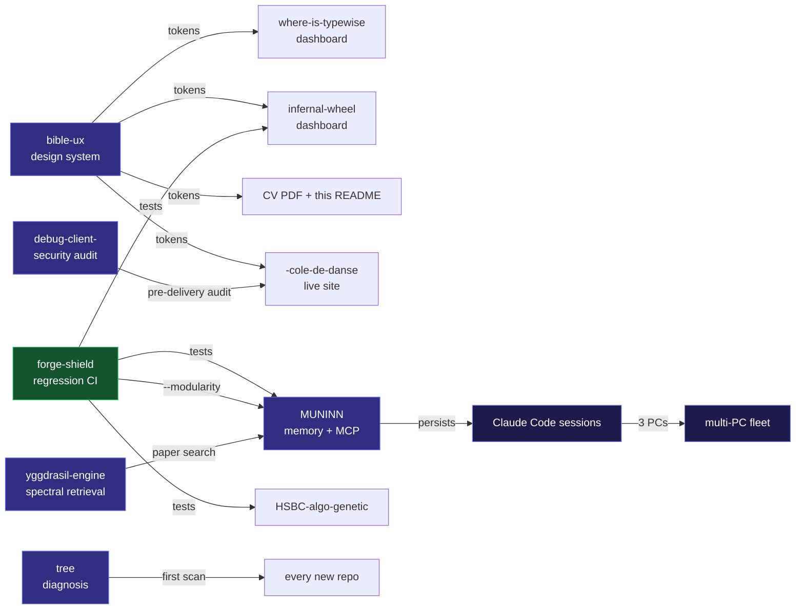

<div align="center">

<a href="https://github.com/sky1241">
  
</a>

<br>


<br><br>

[](mailto:ludovik1241@gmail.com)
[](mailto:ludovik1241@gmail.com)
[](https://haoyanwuying.com)
[](https://pypi.org/project/forge-shield/)

</div>

<br>

## About

Self-taught **AI Engineer** shipping across the stack via AI-orchestrated development. Since January 2026, delivered **10+ technical products** — on-device ML on Wear OS, quantitative trading research, LLM memory + RAG + MCP servers, growth-ops tooling, full-stack Flutter + FastAPI apps, security audit frameworks, and a live production website in China.

Day-to-day: architecture, prompt caching, vector embeddings, fine-tuning pipelines, security hardening, and the integration / debug / deployment work that turns AI output into shipped product.

<table>
<tr>
<td valign="top" width="50%">

### 🇨🇭 Where & how

- Based in **Switzerland** · remote contractor
- French native · English B2
- **2 MCP servers** deployed · **1 PyPI** package
- **2 sites** live in production right now
- 5 days/week active on GitHub since Jan 2026

</td>
<td valign="top" width="50%">

### 🔭 Currently shipping (May 2026)

- **[MUNINN](https://github.com/sky1241/MUNINN-)** v1.2 — compression past x5 + sleep-consolidation pruning
- **[forge-shield](https://github.com/sky1241/forge)** cycle 25 — repeating cycle-15 on 4× larger panel
- **[where-is-typewise](https://github.com/sky1241/where-is-typewise)** — `data/latest` → `main` sync wiring
- **[bible-ux](https://github.com/sky1241/bible-ux)** v1.9 — copyright review pass for Gumroad release

</td>
</tr>
</table>

> 🧪 **Honest science** — I publish admitted negatives in plain sight: forge cycle 12 v3 verdict `0/3 OUI`, HSBC K3 OOS Sharpe –1.91, BUG+053 self-found label-leakage that invalidated prior F1 metrics. Rare in indie OSS — and the reason recruiters can trust the rest of the numbers on this profile.

<br>

## 🔧 How I work

Multi-PC fleet (3 Debian machines, systemd-managed) running **Claude Code in parallel sessions** that talk to each other via a git-branch-based MESSAGE protocol I built. Memory is persisted across sessions through my own MCP server (MUNINN), context is compressed at x4.4 ratio with measured 92% fact retention. Code goes through my own pytest regression shield (forge-shield) before any push.

The result: I ship faster than a solo dev should, with the rigor of a team that has CI gates. The cost is that I had to **build the toolchain itself** — which turned out to be the most interesting part of the work, and the source of half of these projects.

<br>

## 🛠️ My own toolchain — eating my own dog food

These tools are **not portfolio decorations**. Each one is in daily production use by me, in my own workflow. The fact that **this very README** was designed using them is the proof.

| Tool | What I use it for, every day |
|------|-------------------------------|
| 🟢 **[bible-ux](https://github.com/sky1241/bible-ux)** | Source of truth for **every UI / design decision** I make — including this README (HSB indigo palette, density §49, on-color pairs §52, Premium Feel checklist §60-61). My CV PDF, haoyanwuying.com, infernal-wheel dashboard: all token-exported from `VALUES.md`. |
| 🟢 **[forge-shield](https://github.com/sky1241/forge)** | Runs on every commit across my repos — defect prediction, mutation testing, flaky detection, fault localization. Caught BUG+053 (label-leakage) before I shipped infernal-wheel. |
| 🟢 **[MUNINN](https://github.com/sky1241/MUNINN-)** | Persistent memory across all my Claude Code sessions on 3 PCs. x4.4 compression on 230 real files, 92% fact retention. This is the reason I can switch context between MUNINN dev, HSBC live monitoring, and shazam-piano UX without losing state. |
| 🟢 **[yggdrasil-engine](https://github.com/sky1241/yggdrasil-engine)** | When I need to navigate scientific literature — 65K OpenAlex concepts × 108M pairs, spectral retrieval. I ran 38 documented sessions through it. Published the Cohen's d = 5.76 result with bias corrections. |
| 🟢 **[tree](https://github.com/sky1241/tree)** | Project diagnosis + planning — maps a new codebase to one of 6 biological tree architectures (conifer / deciduous / palm / baobab / shrub / liana) and tells me what to build first, what to defer. Used on every new repo since March 2026. |
| 🟢 **[debug-client-](https://github.com/sky1241/debug-client-)** | Security audit framework — 23 SAST tools sandboxed under firejail. I ran it end-to-end against my own `-cole-de-danse` repo before delivering to the client. 14/15 mutation tests confirmed. |

**The signal**: I don't ship libraries I wouldn't run on my own production code. Every public repo on this profile passed through this loop.

### How the tools cross-reference each other



Read as: my own libraries call my own libraries. The downstream effect is that **any improvement to bible-ux propagates to 4 deliveries simultaneously**, any new forge sub-command lints 3 other repos on next push, and any MUNINN compression gain shortens every future Claude Code session across 3 PCs.

<br>

## Selected Projects

<table>
<thead>
<tr><th>Project</th><th>What it does</th><th>Stack</th></tr>
</thead>
<tbody>
<tr>
<td>🟢&nbsp;<b><a href="https://github.com/sky1241/forge">forge-shield</a></b> · <a href="https://pypi.org/project/forge-shield/">PyPI</a></td>
<td>Pytest regression shield · 14 pre-registered scientific cycles · 287 tests across 9 OS/Python combos · 100 % mutation kill vs mutmut 33 %</td>
<td>Python · stdlib-only · <code>mypy --strict</code></td>
</tr>
<tr>
<td>🟢&nbsp;<b><a href="https://github.com/sky1241/where-is-typewise">where-is-typewise</a></b> · <a href="https://where-is-typewise-knsgq4frwunfgefuxp4w3a.streamlit.app">demo</a></td>
<td>Growth-ops radar + MCP server (7 tools) · Claude Haiku scorer with prompt caching · 167 tests · built in 3 h, 30 commits</td>
<td>Python · Anthropic SDK · Streamlit</td>
</tr>
<tr>
<td>🟣&nbsp;<b><a href="https://github.com/sky1241/MUNINN-">MUNINN</a></b></td>
<td>Persistent memory engine for LLMs · x4.4 compression · 92 % fact retention · 10 MCP tools · 3 070 tests</td>
<td>Python 3.13 · MCP · SQLite · tiktoken</td>
</tr>
<tr>
<td>🟣&nbsp;<b><a href="https://github.com/sky1241/HSBC-algo-genetic">HSBC-algo-genetic</a></b></td>
<td>Quant trading research on 14 yr BTC · HMM + GARCH + walk-forward · honest negatives published (DSR, Hansen SPA, anti-lookahead audit)</td>
<td>Python · SciPy · HMM · GARCH</td>
</tr>
<tr>
<td>🟣&nbsp;<b><a href="https://github.com/sky1241/bible-ux">bible-ux</a></b></td>
<td>45 459-line cross-platform UX rules · 1 847 patterns · 20 AI prompt templates · 8 design-token export formats · 180 links / 0 broken</td>
<td>Design tokens · WCAG 2.2 · AI prompts</td>
</tr>
<tr>
<td>🟣&nbsp;<b><a href="https://github.com/sky1241/infernal-wheel">infernal-wheel</a></b></td>
<td>On-device cigarette detection on Samsung smartwatch · TFLite int8 35 KB · 100 % local · 340 tests</td>
<td>Flutter · Kotlin / Compose · TFLite</td>
</tr>
<tr>
<td>🟣&nbsp;<b><a href="https://github.com/sky1241/yggdrasil-engine">yggdrasil-engine</a></b></td>
<td>Spectral engine for scientific cartography · 65 K concepts × 108 M pairs · Cohen's d = 5.76 with documented bias corrections</td>
<td>Python · SciPy eigsh · graph Laplacians</td>
</tr>
<tr>
<td>🟣&nbsp;<b><a href="https://github.com/sky1241/debug-client-">debug-client-</a></b></td>
<td>Security audit framework · 23 SAST tools orchestrated · firejail sandbox · 14/15 mutation tests confirmed</td>
<td>Bash · Python · firejail · SAST</td>
</tr>
<tr>
<td>🟢&nbsp;<b><a href="https://github.com/sky1241/-cole-de-danse">-cole-de-danse</a></b> · <a href="https://haoyanwuying.com">live</a></td>
<td>Dance-school vitrine site in China · mobile-first · WeChat + Baidu Maps integration · zero backend</td>
<td>HTML/CSS/JS · GitHub Pages · schema.org</td>
</tr>
<tr>
<td>🟣&nbsp;<b><a href="https://github.com/sky1241/shazam-piano">shazam-piano</a></b></td>
<td>Shazam-style piano learning · record 8 s → 4 progressive videos · audio DSP from papers (MPM, Goertzel, YIN, Krumhansl-Schmuckler)</td>
<td>Flutter · FastAPI · BasicPitch · FFmpeg</td>
</tr>
</tbody>
</table>

🟢 = currently live in production · 🟣 = source-only

<br>

## 🏆 Recent milestones

```
2026-05-22  ─  forge-shield v2.1.2 released on PyPI · Production/Stable classifier
2026-05-13  ─  MUNINN K.1.bis shipped · 1,336-entry cross-lingual lexicon (MIT + CC0)
2026-05-12  ─  where-is-typewise live on Streamlit Cloud + MCP server (7 tools)
2026-05-11  ─  forge-case-studies cycle 24 verdict: NEUTRAL (∆ + 0.0) — admitted in repo
2026-05-04  ─  Migrated mining stack to MIT-licensed XMR pipeline (3 PCs, systemd)
2026-04-28  ─  HSBC-algo-genetic AUDIT_FINAL_v2: 671 tests passing · READY WITH RESERVATIONS
2026-04-26  ─  RAPPORT_ALPHA_FINAL: K3 alone Sharpe –1.91 published · honest negative
2026-04-17  ─  bible-ux meta-audit: 180 links / 0 broken · 0 contradictions VALUES ↔ bibles
2026-04-14  ─  BUG+053 self-found: label-leakage in infernal-wheel training set · fixed + reported
2026-04-10  ─  infernal-wheel: 2 real-world cigarette detections on Galaxy Watch 7
2026-03-02  ─  yggdrasil blind spectral test: Cohen's d = 5.76 (p = 7e-11)
2025-12-19  ─  haoyanwuying.com deployed (custom CNAME, mobile-first, China market)
2026-01-XX  ─  Started writing code seriously · self-taught from zero
```

<br>

## Tech Stack

<div align="center">


</div>

<br>

## 📊 Stats

<div align="center">

<a href="https://github.com/sky1241">
  
  
</a>

<br>


</div>

<br>

## 🤝 Open to

- **Freelance contracts** (Malt / Codeur / direct) — Python · Flutter · AI tooling · sysadmin Linux
- **YC startup roles** (Work at a Startup) — AI Engineer / Growth Engineer / Indie founder
- **Audit & consulting** — security audit (debug-client-), quant infra (HSBC), LLM memory (MUNINN)

<div align="center">

<br>

### 📬 Reach out

**[ludovik1241@gmail.com](mailto:ludovik1241@gmail.com)** &nbsp;·&nbsp; **[haoyanwuying.com](https://haoyanwuying.com)** (a recent delivery) &nbsp;·&nbsp; **[pypi.org/project/forge-shield](https://pypi.org/project/forge-shield/)**

<br>

<sub><i>Rendered with <b><a href="https://github.com/sky1241/bible-ux">bible-ux</a></b> v1.9 — §38 Tailwind typography scale · §42 outline iconography · §49 Linear density (max 4 contrast levels, 4 px grid implicit) · §50 Vercel Geist label-vs-copy line-heights · §52 Stripe on-color pairs (every badge has <code>labelColor</code>) · §60 Premium Feel anti-patterns avoided (no gimmick, animation = cause visible) · §61 Premium Feel checklist (3-token color ramp, semantic accent indigo, on-color accessible pairs). The proof that bible-ux is operational is the document you just finished reading.</i></sub>

<br>


</div>
